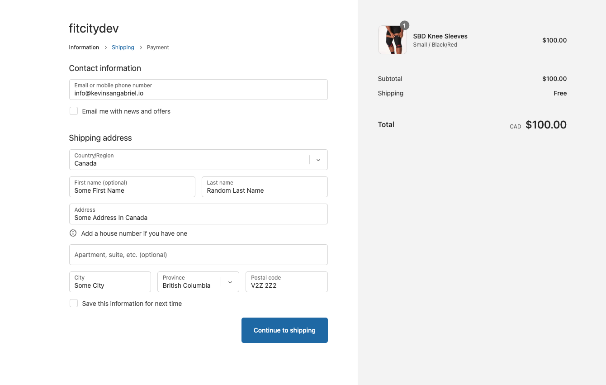
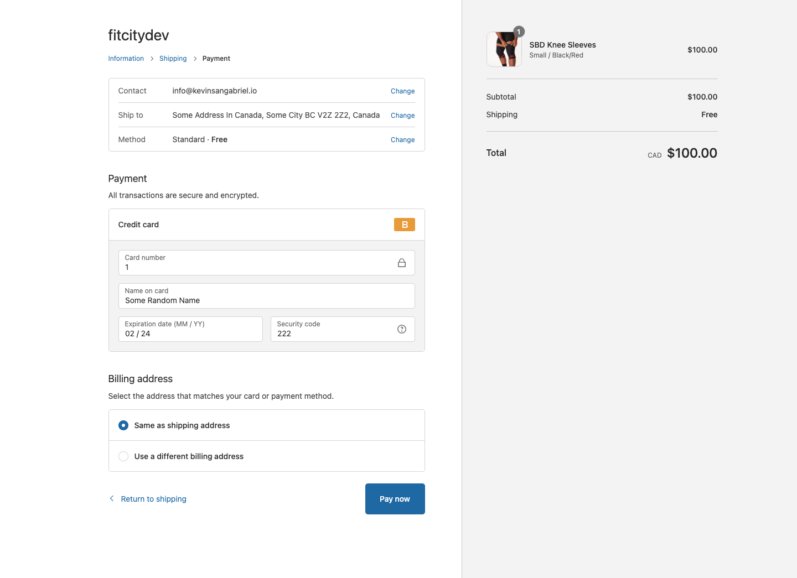

### Fit City

A React web app which consumes a Ruby on Rails API integrated with a GraphQL Shopify Storefront API

## How to run the app locally

1. Clone the repo

```
git clone https://github.com/ksg604/fitcity.git
```

2. Open a terminal shell window and cd into the directory you just cloned

```
cd fitcity
```

3. Run the following command 

```
make start
```

Now open a internet browser window and go to http://localhost:3000.

*Note: In order to view product pages, login, and make orders, the backend must be running as well.  There is currently no way to run the backend locally because of personal privacy reasons.  If you wish to see the full functionality of Fit City, proceed to the live version at http://fitcity.s3-website-us-west-2.amazonaws.com/.

Otherwise, you can see the code for the backend at https://github.com/ksg604/fitcity-api

<!-- Now open a internet browser window and go to http://localhost:3000.  In order to view product pages, login as a user, and make orders, you must run the backend as well.  Proceed to https://github.com/ksg604/fitcity-api for more details on getting the backend started.

You can log in with the following test credentials

username
```
user1@gmail.com
```

password
```
Password1234!
```

Or, sign up and login with your email and password of choice.  If you sign up with a real email, you will receive a confirmation email indicating that you have been activated as customer for the store fitcitydev.  Please note that being activated as a customer for the store means that your email is saved by the store.  If you wish your customer account to be unactivated, please email me anytime at info@kevinsangabriel.io.

*Note: Your email is saved for mock purposes.  The fitcitydev Shopify store is not operational and entirely only for testing.*

## Payments

You can play around with purchasing products by adding items to your cart and checking out.



For the contact information, enter the email you want your order confirmation sent to.  For shipping address, entering a fake address will work.



On the checkout page, place a mock order by enter a credit card number of "1" for a successful transaction, or "2" for a failed transaction.

Enter any date in the future for the date and any 3-digit number for the CVV

*Important: Ensure that the contact information you enter is yours.  Placing an order will send order confirmation emails to the contact information you supply.* -->
